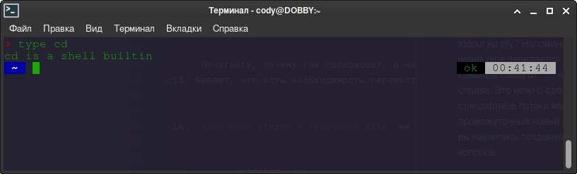
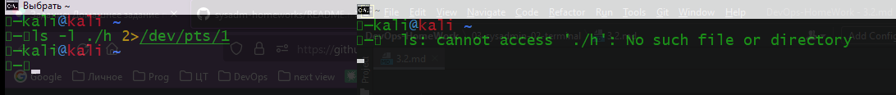
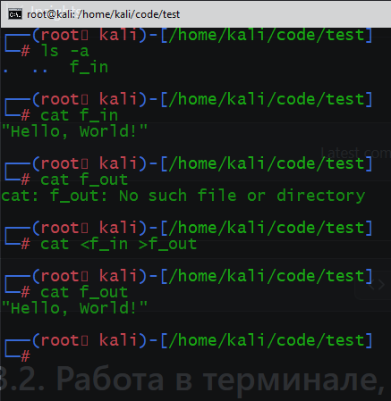
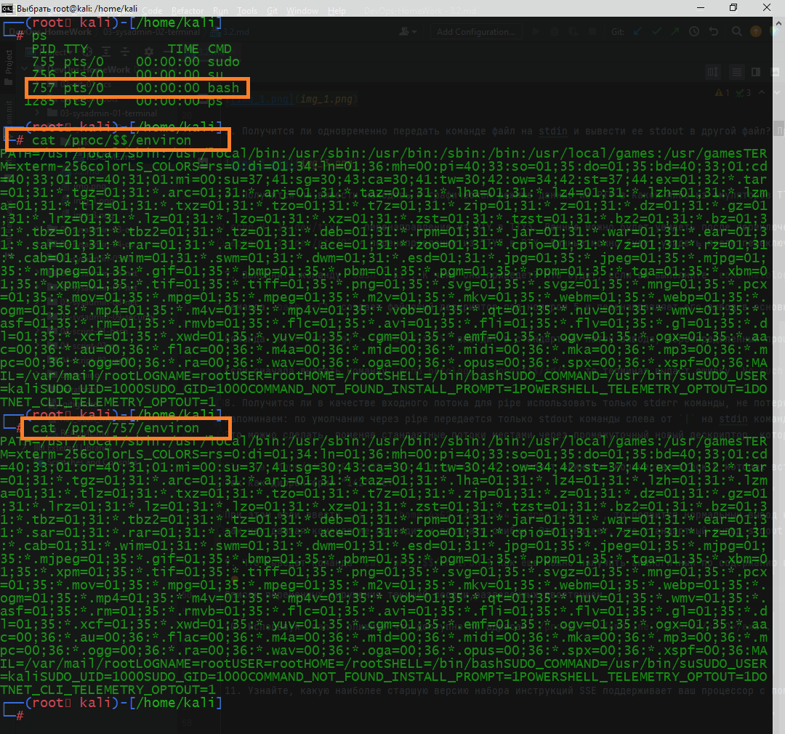
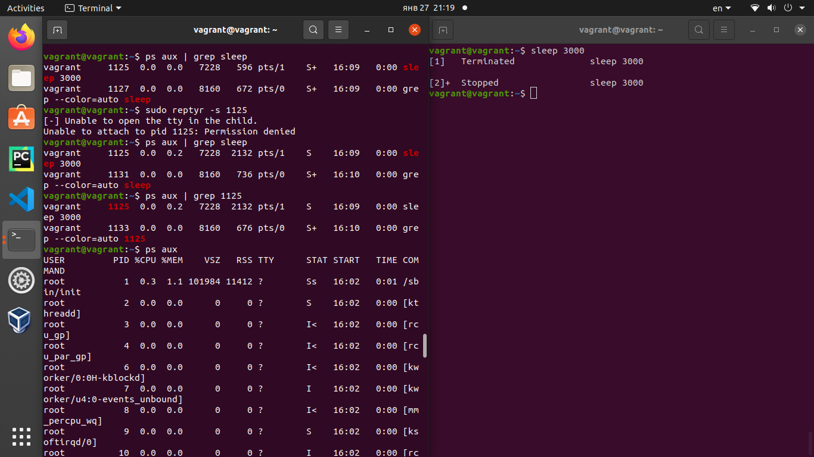

## Домашнее задание № 3.2

1. Какого типа команда `cd`? Попробуйте объяснить, почему она именно такого типа; опишите ход своих мыслей, если считаете что она могла бы быть другого типа.

`type cd` -  это встроенная команда Bash, так как ее нет в файловой системе. Для утилит, команда type вернет путь к файлу. 


2. Какая альтернатива без pipe команде `grep <some_string> <some_file> | wc -l`? `man grep` поможет в ответе на этот вопрос. Ознакомьтесь с [документом](http://www.smallo.ruhr.de/award.html) о других подобных некорректных вариантах использования pipe.

`grep <some_string> <some_file> -c`

3. Какой процесс с PID `1` является родителем для всех процессов в вашей виртуальной машине Ubuntu 20.04?

Команда `pstree -p` выдает результат `systemd(1)`- это системный менеджер для Linux. Выполняется в качестве первого процесса загрузки (`PID-1`) 
Команда `ps aux | grep 1` сообщает, что процесс с PID `1` это `/sbin/init` - символическая ссылка на /lib/systemd/systemd

4. Как будет выглядеть команда, которая перенаправит вывод stderr `ls` на другую сессию терминала?



5. Получится ли одновременно передать команде файл на stdin и вывести ее stdout в другой файл? Приведите работающий пример.
 


6. Получится ли вывести находясь в графическом режиме данные из PTY в какой-либо из эмуляторов TTY? Сможете ли вы наблюдать выводимые данные?
 
`echo Hi 1>/dev/tty3` - перенаправление из PTY в TTY3. Данные можно будет увидеть после переключения в эмулятор TTY.
`echo Hi 1>/dev/pts/0` - перенаправление из TTY3 в PTY. Данные можно будет увидеть после переключения из эмулятора TTY в графический режим.

7. Выполните команду `bash 5>&1`. К чему она приведет? Что будет, если вы выполните `echo netology > /proc/$$/fd/5`? Почему так происходит?
 
Команда `bash 5>&1` создает файловый дескриптор под номером 5 и перенаправляет его вывод в основной поток вывода.

Команда `echo netology > /proc/$$/fd/5` выводит в стандартный поток вывода, переопределенный прошлой командой, через пятый файловый дескриптор слово `netology`.

Если сначала вызвать команду `echo netology > /proc/$$/fd/5`, то терминал выдаст ошибку `No such file or directory`

8. Получится ли в качестве входного потока для pipe использовать только stderr команды, не потеряв при этом отображение stdout на pty? 
Напоминаем: по умолчанию через pipe передается только stdout команды слева от `|` на stdin команды справа.
Это можно сделать, поменяв стандартные потоки местами через промежуточный новый дескриптор, который вы научились создавать в предыдущем вопросе.

`ls -la /home/142 4>&2 2>&1 1>&4 | grep such -с` - выдаст единицу (количество строк в которых встречается слово "such" из строки `No such file or directory`), 
так как дирректории "142" нет. 

При этом если ввести `ls -la /home 4>&2 2>&1 1>&4 | grep such -с`, то появится нормальный вывод команды `ls -la /home`, 
так как данная команда не приводит к возврату ошибки. Это означает, что стандартный вывод stdout сохранен. 

9. Что выведет команда `cat /proc/$$/environ`? Как еще можно получить аналогичный по содержанию вывод?
 
Список переменных окружения текущей сессии,разделенных двоеточием.


На изображениии я получил один и тот же вывод двумя способами `cat /proc/$$/environ` и `cat /proc/757/environ`, 
так как двой ной знак `$$` означает текущий процесс оболочки. Подставив PID текущего процесса мы получаем тот же вывод.

10. Используя `man`, опишите что доступно по адресам `/proc/<PID>/cmdline`, `/proc/<PID>/exe`.
 
`/proc/<PID>/cmdline` - этот доступный только для чтения файл содержит полную командную строку для вызова процесса, если этот процесс не является зомби.

`/proc/<PID>/exe` - в Linux начиная с версии 2.2 этот файл является символической ссылкой, содержащей фактический путь к запускающей команде.
 
11. Узнайте, какую наиболее старшую версию набора инструкций SSE поддерживает ваш процессор с помощью `/proc/cpuinfo`.
 
`cat /proc/cpuinfo | grep sse*` - sse4_2

 12. При открытии нового окна терминала и `vagrant ssh` создается новая сессия и выделяется pty. Это можно подтвердить командой `tty`, 
которая упоминалась в лекции 3.2. Однако:

     ```bash
     vagrant@netology1:~$ ssh localhost 'tty'
     not a tty
     ```

     Почитайте, почему так происходит, и как изменить поведение.

При подключении по ssh к серверу и при попытке запуска команды на удаленном компьютере с помощью ssh, 
TTY не выделяется для удаленного сеанса. То есть если удаленный узел обнаружит, что пользователь не является человеком (так как 
вход не является терминалом tty, а является другим процессом), то он может предупредить пользователя об этом неожиданном состоянии.
Опция -t позволяет принудительно выделить псевдотерминал для процесса: 

`ssh -t localhost 'tty'`

результат:
`/dev/pts/1`

13. Бывает, что есть необходимость переместить запущенный процесс из одной сессии в другую. 
Попробуйте сделать это, воспользовавшись `reptyr`. Например, так можно перенести в `screen` 
процесс, который вы запустили по ошибке в обычной SSH-сессии.



14. `sudo echo string > /root/new_file` не даст выполнить перенаправление под обычным пользователем, 
так как перенаправлением занимается процесс shell'а, который запущен без `sudo` под вашим пользователем. 
Для решения данной проблемы можно использовать конструкцию `echo string | sudo tee /root/new_file`. 
Узнайте что делает команда `tee` и почему в отличие от `sudo echo` команда с `sudo tee` будет работать.

`tee` - чтение из стандартного ввода и запись в стандартный вывод и файл одновременно

`sudo echo string > /root/new_file`
первая часть команды вызывается под sudo, но на перенаправление вывода sudo не действует

`echo string | sudo tee /root/new_file`
в первой части команды производится вывод строки в стандартный поток вывода и передается через конвейер второй команде,
которая выполняет чтение из стандартного потока ввода (через pipe) и запись под sudo в файл.

в конвейере вторая часть команды выполняется под sudo поэтому выполняется без ошибки

[На главную](README.md)
