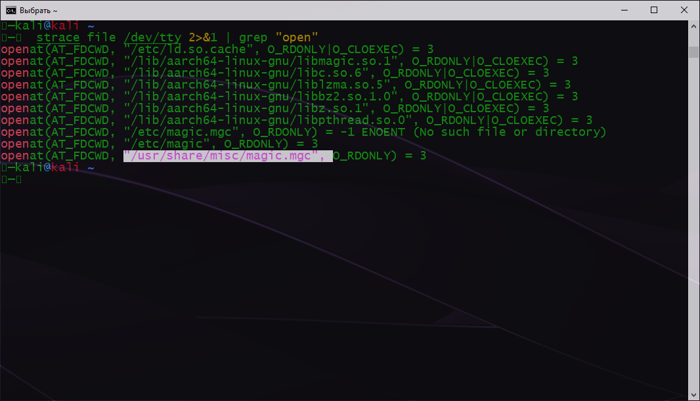

# Домашнее задание № 3.3. "Операционные системы, лекция 1"

1. Какой системный вызов делает команда `cd`? В прошлом ДЗ мы выяснили, что `cd` не является самостоятельной  программой, 
это `shell builtin`, поэтому запустить `strace` непосредственно на `cd` не получится. Тем не менее, вы можете запустить 
`strace` на `/bin/bash -c 'cd /tmp'`. В этом случае вы увидите полный список системных вызовов, которые делает сам `bash` 
при старте. Вам нужно найти тот единственный, который относится именно к `cd`.

`chdir("/tmp")`

2. Попробуйте использовать команду `file` на объекты разных типов на файловой системе. Например:
    ```bash
    vagrant@netology1:~$ file /dev/tty
    /dev/tty: character special (5/0)
    vagrant@netology1:~$ file /dev/sda
    /dev/sda: block special (8/0)
    vagrant@netology1:~$ file /bin/bash
    /bin/bash: ELF 64-bit LSB shared object, x86-64
    ```
    Используя `strace` выясните, где находится база данных `file` на основании которой она 
делает свои догадки.

Согласно `man file` - утилита `file` определяет тип файл исследуя содержимое файла, 
которое она сопоставляет с базой данных, которая, в свою очередь, расположена по адресу   
`/usr/share/misc/magic.mgc`, или ищет файл в дирректории `/usr/share/misc/magic`

 

3. Предположим, приложение пишет лог в текстовый файл. Этот файл оказался удален (deleted в lsof), 
однако возможности сигналом сказать приложению переоткрыть файлы или просто перезапустить 
приложение – нет. Так как приложение продолжает писать в удаленный файл, место на диске постепенно 
заканчивается. Основываясь на знаниях о перенаправлении потоков предложите способ обнуления открытого 
удаленного файла (чтобы освободить место на файловой системе).

Нашел в просторах интернета такой способ `cat /dev/null > /proc/&&/fd/1`

4. Занимают ли зомби-процессы какие-то ресурсы в ОС (CPU, RAM, IO)?

Процесс при завершении освобождаетс все свои ресурсы и становится "зомби" - пустой записью в таблице процессов.

5. В iovisor BCC есть утилита `opensnoop`:
    ```bashREADME.mdREADME.mdREADME.mdREADME.mdREADME.mdREADME.mdREADME.mdREADME.mdREADME.mdREADME.mdREADME.mdREADME.mdREADME.mdREADME.mdREADME.mdREADME.mdREADME.mdREADME.mdREADME.mdREADME.mdREADME.mdREADME.mdREADME.mdREADME.mdREADME.mdREADME.mdREADME.mdREADME.mdREADME.mdREADME.mdREADME.mdREADME.mdREADME.mdREADME.mdREADME.mdREADME.mdREADME.mdREADME.mdREADME.mdREADME.mdREADME.mdREADME.mdREADME.mdREADME.mdREADME.mdREADME.mdREADME.mdREADME.mdREADME.mdREADME.mdREADME.mdREADME.mdREADME.mdREADME.mdREADME.mdREADME.md
    root@vagrant:~# dpkg -L bpfcc-tools | grep sbin/opensnoop
    /usr/sbin/opensnoop-bpfcc
    ```
    На какие файлы вы увидели вызовы группы `open` за первую секунду работы утилиты? Воспользуйтесь пакетом `bpfcc-tools` для Ubuntu 20.04. Дополнительные [сведения по установке](https://github.com/iovisor/bcc/blob/master/INSTALL.md).

```bash
    root@vagrant:~# /usr/sbin/opensnoop-bpfcc -d 1
    PID    COMM               FD ERR PATH
    766    vminfo              4   0 /var/run/utmp
    562    dbus-daemon        -1   2 /usr/local/share/dbus-1/system-services
    562    dbus-daemon        20   0 /usr/share/dbus-1/system-services
    562    dbus-daemon        -1   2 /lib/dbus-1/system-services
    562    dbus-daemon        20   0 /var/lib/snapd/dbus-1/system-services/
```

6. Какой системный вызов использует `uname -a`? Приведите цитату из man по этому системному вызову, где описывается 
альтернативное местоположение в `/proc`, где можно узнать версию ядра и релиз ОС.

`uname({sysname="Linux", nodename="vagrant", ...}) = 0`

man мне не показал ничего подобного. На двух OS Linux и в vagrant получил одинаковый урезанный результат man.
На сайтах содержащих информацию по man тоже нет ничего про `/proc` 


в одной статье нашел только отрывок:

     Part of the utsname information is also accessible  via  /proc/sys/ker‐
       nel/{ostype, hostname, osrelease, version, domainname}.


7. Чем отличается последовательность команд через `;` и через `&&` в bash? Например:
    ```bash
    root@netology1:~# test -d /tmp/some_dir; echo Hi
    Hi
    root@netology1:~# test -d /tmp/some_dir && echo Hi
    root@netology1:~#
    ```
    Есть ли смысл использовать в bash `&&`, если применить `set -e`?

`;` - раздеяет последовательность команд, если какая-либо команда не выполняется, то остальные все равно будут исполнены  
`&&` - условный оператор. вся последовательность будет выполнена, если каждая из команд успешно выполняется, 
но если одна из команд возвращает ошибку или 0, то и другие команды из последовательности не будут выполнены. 

`set -e` - при неудачном завершении конвейера, или группы команд, заключенных в фигурные скобки, происходит выход из оболочки.
Есть пять исключений, при которых неудачное завершение команды не приводит к выходу из оболочки. 
Одно из исключений: 
В логической операции `&&` или `||` имеется любая команда, кроме последней.  

8. Из каких опций состоит режим bash `set -euxo pipefail` и почему его хорошо было бы использовать в сценариях?

`-e` - поведение описано выше.
`-u` - интерпретировать при подстановках неустановленные переменные как ошибки.
`-x` - отображать комманды вместе с их аргументами, когда они выполняются, предверяя их приглашением из переменной PS4.
Этим обеспечивается пошаговая трассировка сценариев оболочки.
`-o pipefail` - Активирует режим оболочки `pipefail`- заменить код завершения конвейера на код завершения последней неудачно завершившейся команды или 
нулевой код завершения, если все оманды в конвейере завершились удачно.

9. Используя `-o stat` для `ps`, определите, какой наиболее часто встречающийся статус у 
процессов в системе. В `man ps` ознакомьтесь (`/PROCESS STATE CODES`) что значат 
дополнительные к основной заглавной буквы статуса процессов. Его можно не учитывать 
при расчете (считать S, Ss или Ssl равнозначными).

```bash
  ps -o stat
    STAT
    Ss
    R+
```

`S` - спящий процесс с возможностью прервать сон. Процесс ожидающий завершения. 
`R` - работающий или подлежащий запуску процесс (в очереди выполнения).

маленькие символы или знаки применяются для определения приоритета выполнения или доп опций.
