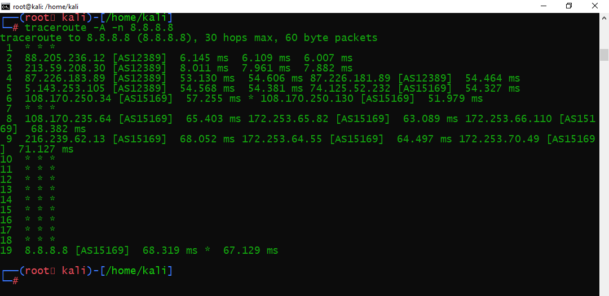
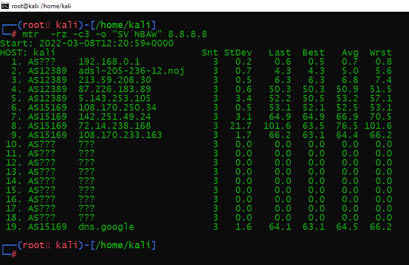

# Домашняя работа к занятию "3.6. Компьютерные сети, лекция 1"

1. Работа c HTTP через телнет.

- Подключитесь утилитой телнет к сайту stackoverflow.com telnet stackoverflow.com 80
- отправьте HTTP запрос

```BASH
GET /questions HTTP/1.0
HOST: stackoverflow.com
[press enter]
[press enter]
```
- В ответе укажите полученный HTTP код, что он означает?


В ответе указаны протокол и версия, а также код 301 с пояснением - пстоянное перенаправление, применяется по разным 
причинам для преднамеренного перенаправления с посещаемой ссылки на другой адрес.
Также в ответе указаны заголовки:
- кэширования, 
- адрес на который произведено перенаправление, 
- уникальный ID запроса
- для управления политиками браузера.
и другие заголовки для информирования и управления поведением браузера.

2. Повторите задание 1 в браузере, используя консоль разработчика F12.

- откройте вкладку Network
- отправьте запрос http://stackoverflow.com 
- найдите первый ответ HTTP сервера, откройте вкладку Headers 
- укажите в ответе полученный HTTP код. ```200 OK```
- проверьте время загрузки страницы, какой запрос обрабатывался дольше всего? 
- приложите скриншот консоли браузера в ответ.


3. Какой IP адрес у вас в интернете? 

У меня статический IP - 90.150.52.49 - к которому привязана запись DNS


4. Какому провайдеру принадлежит ваш IP адрес? Какой автономной системе AS? Воспользуйтесь утилитой whois 


5. Через какие сети проходит пакет, отправленный с вашего компьютера на адрес 8.8.8.8? Через какие AS? Воспользуйтесь утилитой traceroute 



6. Повторите задание 5 в утилите mtr. На каком участке наибольшая задержка - delay?



Наибольшая задержка на 72.14.238.168 `Avg = 76.5 ms`

7. Какие DNS сервера отвечают за доменное имя dns.google? Какие A записи? воспользуйтесь утилитой dig 


8. Проверьте PTR записи для IP адресов из задания 7. Какое доменное имя привязано к IP? воспользуйтесь утилитой dig


