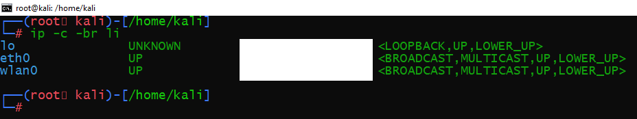
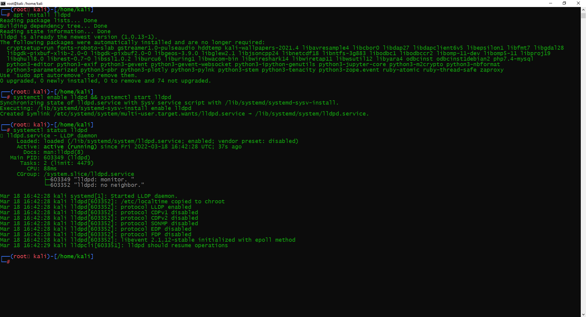

# Домашняя работа к занятию "3.7. Компьютерные сети, лекция 2"

1. Проверьте список доступных сетевых интерфейсов на вашем компьютере. Какие команды есть для этого в Linux и в Windows? 




Win: ipconfig
Linux: ifconfig

2. Какой протокол используется для распознавания соседа по сетевому интерфейсу? 
Какой пакет и команды есть в Linux для этого? 

LLDP



3. Какая технология используется для разделения L2 коммутатора на несколько виртуальных 
сетей? Какой пакет и команды есть в Linux для этого? Приведите пример конфига. 

VLAN - виртуальное разделение коммутатора

vlan - пакет в Linux

`ip link add link eth0 nmae eth0.10 type vlan id 10`

`vconfig add eth0 5`

Создаем новые VLAN интерфейсы в файле `/etc/network/interfaces`. Например для VLAN 2 и 3 где родительская сеть висит на интерфейсе eth0:

```commandline
auto eth0.100
auto eth0.200

iface eth0.100 inet static
address 192.168.2.1
netmask 255.255.255.0
network 192.168.2.0
broadcast 192.168.2.255
mtu 1500
vlan_raw_device eth0

iface eth0.200 inet static
address 10.10.3.3
netmask 255.255.255.0
network 10.10.3.0
broadcast 10.10.3.255
mtu 1500
vlan_raw_device eth0
```

`sudo /etc/init.d/networking restart`

4. Какие типы агрегации интерфейсов есть в Linux? Какие опции есть для балансировки 
нагрузки? Приведите пример конфига. 

- Mode-0(balance-rr) - Данный режим используется по умолчанию.
- Mode-1(active-backup) - Один из интерфейсов работает в активном режиме, остальные в ожидающем. 
- Mode-2(balance-xor) - Передача пакетов распределяется по типу входящего и исходящего трафика по формуле ((MAC src) XOR (MAC dest)) % число интерфейсов. 
- Mode-3(broadcast) - Происходит передача во все объединенные интерфейсы, тем самым обеспечивая отказоустойчивость.
- Mode-4(802.3ad) - Динамическое объединение одинаковых портов.
- Mode-5(balance-tlb) - Адаптивная балансировки нагрузки трафика.
- Mode-6(balance-alb) - Адаптивная балансировка нагрузки.

```commandline
auto bond0
iface bond0 inet static
  address 192.168.1.2
  netmask 255.255.255.0
  network 192.168.1.0
  broadcast 192.168.1.255
  gateway 192.168.1.1
  dns-nameservers 192.168.1.1
  bond_mode 802.3ad
  bond_miimon 100
  bond_downdelay 200
  bond_updelay 200
  slaves eth0 eth1
```

5. Сколько IP адресов в сети с маской /29 ? 
Сколько /29 подсетей можно получить из сети с маской /24. 
Приведите несколько примеров /29 подсетей внутри сети 10.10.10.0/24. 

8 IP адресов.

32 подсетей

6. Задача: вас попросили организовать стык между 2-мя организациями. 
Диапазоны 10.0.0.0/8, 172.16.0.0/12, 192.168.0.0/16 уже заняты. 
Из какой подсети допустимо взять частные IP адреса? 
Маску выберите из расчета максимум 40-50 хостов внутри подсети.

100.64.0.0/26

7. Как проверить ARP таблицу в Linux, Windows? Как очистить ARP кеш полностью? 
Как из ARP таблицы удалить только один нужный IP?

Linux:

`ip neighbour` - отображает текущие ARP-записи

`ip neigh flush all` - удаление всех узлов

`ip neigh flush <ip>` - удаление IP


Windows

`arp -a` - отображает текущие ARP-записи

`arp -d *` - удаление всех узлов

`arp -d <ip>` - удаление IP