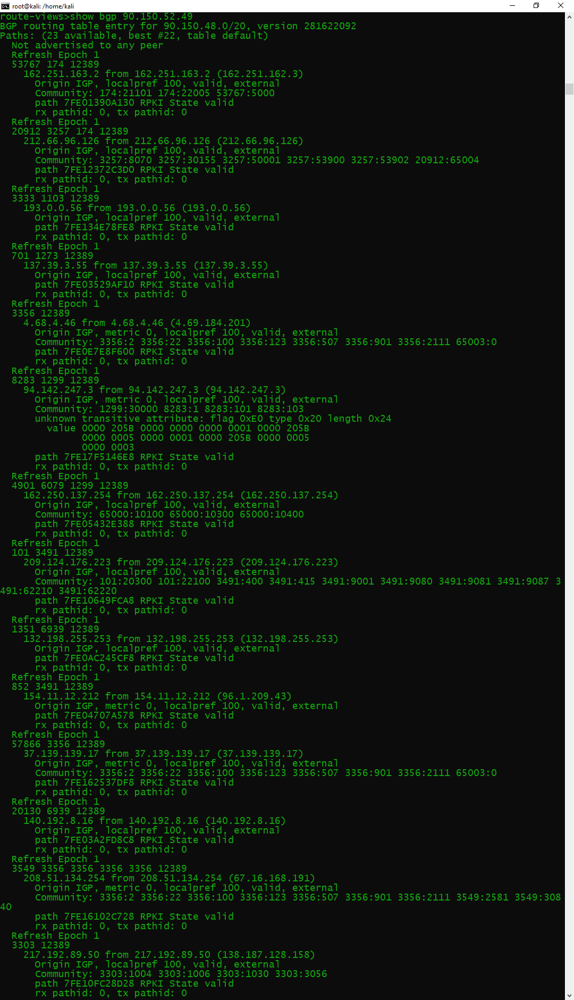
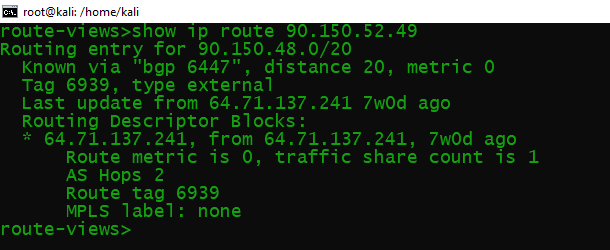
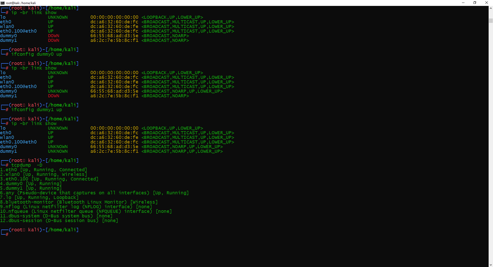
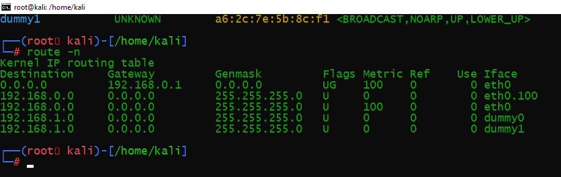
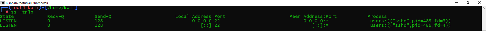
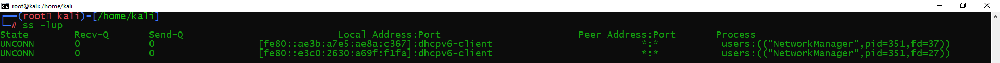
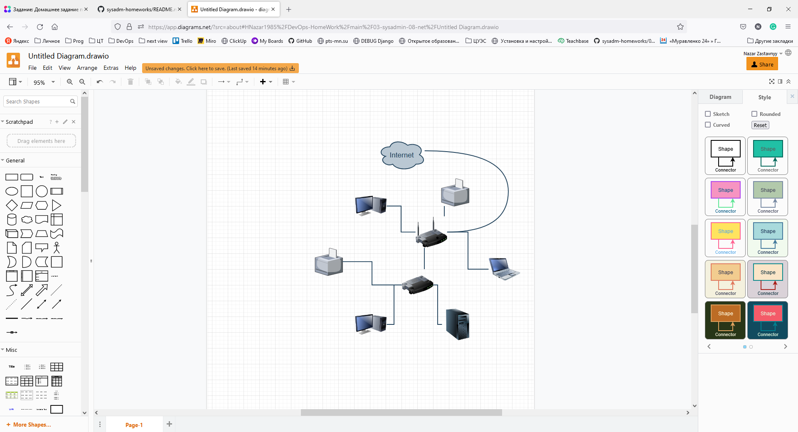

# Домашняя работа к занятию "3.8. Компьютерные сети, лекция 3"

1. Подключитесь к публичному маршрутизатору в интернет. Найдите маршрут к вашему публичному IP

```commandline
telnet route-views.routeviews.org
Username: rviews
show ip route x.x.x.x/32
show bgp x.x.x.x/32
```





2. Создайте dummy0 интерфейс в Ubuntu. Добавьте несколько статических маршрутов. 
Проверьте таблицу маршрутизации.





3. Проверьте открытые TCP порты в Ubuntu, какие протоколы и приложения используют 
эти порты? Приведите несколько примеров.

 

Используют протокол SSH через порт 22, по которому я подключен к RPi

4. Проверьте используемые UDP сокеты в Ubuntu, какие протоколы и приложения используют 
эти порты?



DHCPv6 - сетевой протокол IPv6 порт 546. NetworkManager - инструмент управления сетевыми подключениями в Linux.

5. Используя diagrams.net, создайте L3 диаграмму вашей домашней сети или любой другой 
сети, с которой вы работали.



Моя домашняя сеть.
Роутер подключен к к оптике и раздает по Wifi интернет на сотовые, принтер и ноутбук жены.
Не нашел значка Xbox, который подключен через коммутатор к роутеру.
Также к коммутатору подключен моя МФУ, рабочий компьютер и RPi4 (изобразил в виде сервера).
