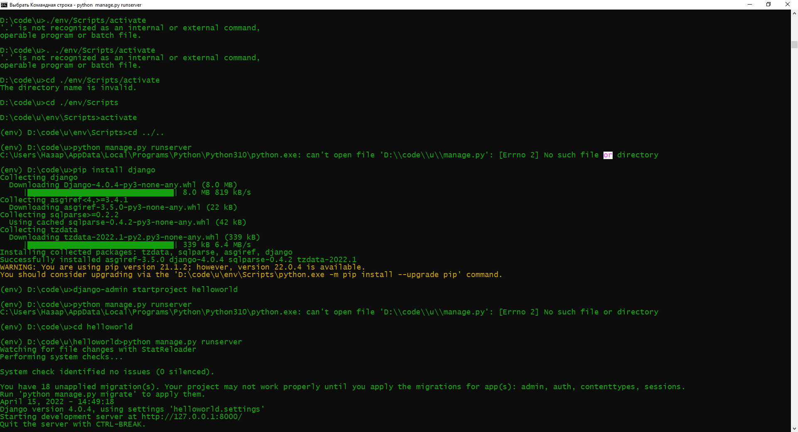
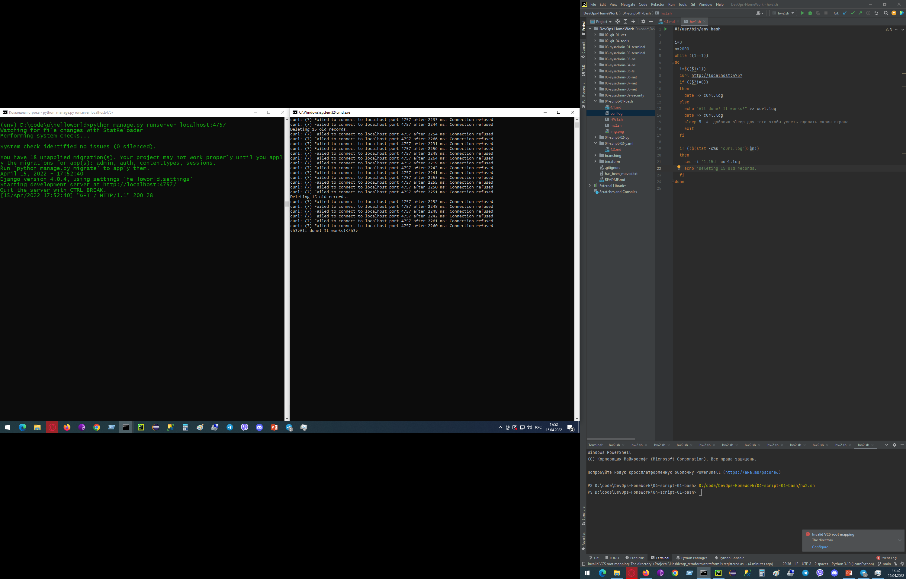

# Домашнее задание к занятию "4.1. Командная оболочка Bash: Практические навыки"

## Обязательная задача 1

Есть скрипт:
```bash
a=1
b=2
c=a+b
d=$a+$b
e=$(($a+$b))
```

Какие значения переменным c,d,e будут присвоены? Почему?

| Переменная  | Значение | Обоснование |
| ------------- | ------------- | ------------- |
| `c`  | a+b  | Присваиваем переменной c строковое значение "a+b", а не сумму переменных $a+$b  |
| `d`  | 1+2  | Производится подстановка значений переменных, но в общем происходит, по прежнему, присвоение переменной строки "1+2"  |
| `e`  | 3  | Выполняется арифметическое сложение значений переменных. Конструкция $(()) в данном случае воспринимается как вызов арифметической функции |


## Обязательная задача 2
На нашем локальном сервере упал сервис и мы написали скрипт, который постоянно проверяет его 
доступность, записывая дату проверок до тех пор, пока сервис не станет доступным (после чего 
скрипт должен завершиться). В скрипте допущена ошибка, из-за которой выполнение не может 
завершиться, при этом место на Жёстком Диске постоянно уменьшается. Что необходимо сделать, 
чтобы его исправить:

```bash
while ((1==1)
do
	curl https://localhost:4757
	if (($? != 0))
	then
		date >> curl.log
	fi
done
```

### Ваш скрипт:
```bash
i=0
n=2000
while ((1==1))
do
  i=$(($i+1))
	curl http://localhost:4757
	if (($?!=0))
	then
		date >> curl.log
	else
	  echo "All done! It works!" >> curl.log
	  date >> curl.log
    sleep 5  #  добавил sleep для того чтобы успеть сделать скрин экрана
	  exit
	fi

	if (($(stat -c%s "curl.log")>$n))
	then
    sed -i '1,15d' curl.log
    echo 'Deleting 15 old records.'
	fi
done
```

Подготовил проект Django c одной функцией, генерирующей строку <h3>All done! It works!</h3> 



Запустил скрипт, который проверят доступность сервиса. После нескольких проверок размер файла превысил 2000b, что привело 
к удалению 15 первых строк файла curl.log, а также выводит сообщение об этом. Это позволит искючить вероятность переполнения памяти HDD.
При запуске тестового сервера по адресу http://localhost:4757 скрипт сохраняет дату и время успешного подключения и 
строку с сообщением что все работает. После чего скрипт завершается выводом страницы запрашиваемого сервиса.



## Обязательная задача 3
Необходимо написать скрипт, который проверяет доступность трёх IP: 
`192.168.0.1`, `173.194.222.113`, `87.250.250.242` по `80` порту и записывает результат 
в файл `log`. Проверять доступность необходимо пять раз для каждого узла.

### Ваш скрипт:
```bash
hosts=("192.168.0.1:80" "173.194.222.133:80" "87.250.250.242:80")

for host in "${hosts[@]}"; do
  for i in {1..5}; do
    status=$(curl -Is --connect-timeout 5 "$host" | grep HTTP | awk '{print $2 " " $3 " " $4}')
    echo "$host" "status = $status" >> hosts.log
  done
done
```

## Обязательная задача 4
Необходимо дописать скрипт из предыдущего задания так, чтобы он выполнялся до тех пор, 
пока один из узлов не окажется недоступным. Если любой из узлов недоступен - IP этого 
узла пишется в файл error, скрипт прерывается.

### Ваш скрипт:
```bash
???
```

## Дополнительное задание (со звездочкой*) - необязательно к выполнению

Мы хотим, чтобы у нас были красивые сообщения для коммитов в репозиторий. 
Для этого нужно написать локальный хук для git, который будет проверять, что сообщение в 
коммите содержит код текущего задания в квадратных скобках и количество символов в 
сообщении не превышает 30. Пример сообщения: \[04-script-01-bash\] сломал хук.

### Ваш скрипт:
```bash
???
```