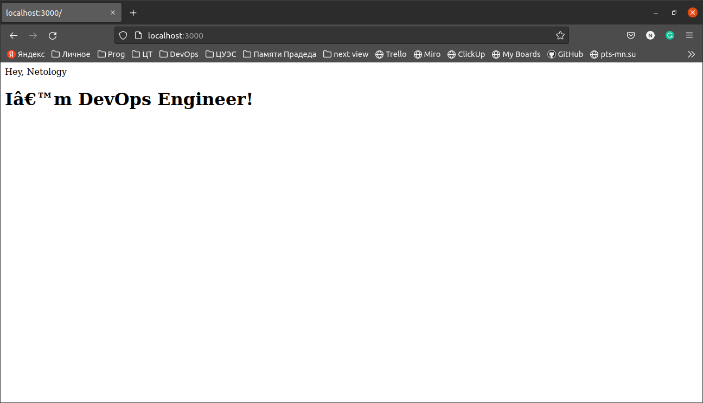

# Домашнее задание к занятию "5.3. Введение. Экосистема. Архитектура. Жизненный цикл Docker контейнера"

## Задача 1

Сценарий выполения задачи:

- создайте свой репозиторий на https://hub.docker.com;


- выберете любой образ, который содержит веб-сервер Nginx;

`docker pull nginx`

- создайте свой fork образа;
- реализуйте функциональность:
запуск веб-сервера в фоне с индекс-страницей, содержащей HTML-код ниже:
```
<html>
<head>
Hey, Netology
</head>
<body>
<h1>I’m DevOps Engineer!</h1>
</body>
</html>
```
Опубликуйте созданный форк в своем репозитории и предоставьте ответ в виде ссылки на https://hub.docker.com/username_repo.




[https://hub.docker.com/repository/docker/nazar1985/devops_hw](https://hub.docker.com/repository/docker/nazar1985/devops_hw)

## Задача 2

Посмотрите на сценарий ниже и ответьте на вопрос:
"Подходит ли в этом сценарии использование Docker контейнеров или лучше подойдет 
виртуальная машина, физическая машина? Может быть возможны разные варианты?"

Детально опишите и обоснуйте свой выбор.

--

Сценарий:

- Высоконагруженное монолитное java веб-приложение;

###### Подходит Docker, так как при этом используется оборудование хоста, а контейнеризация не ограничивает ресурсы хоста. Но можно и виртуалку развернуть, главное, чтобы было было выделен достаточный ресурс.

- Nodejs веб-приложение;

###### Подходит Docker, это наиболее распространенная практика

- Мобильное приложение c версиями для Android и iOS;

###### Затрудняю ответить. Нужно изучить этот вопрос. Думаю, что можно оба варианта.

- Шина данных на базе Apache Kafka;

###### Подходит оба варианта.

- Elasticsearch кластер для реализации логирования продуктивного веб-приложения - три ноды elasticsearch, два logstash и две ноды kibana;

###### Можно оба варианта

- Мониторинг-стек на базе Prometheus и Grafana;

###### Не знаком об ограничениях. порты можно пробросить для работы мониторов в обоих случаях, но думаю легче будет настроить в Docker

- MongoDB, как основное хранилище данных для java-приложения;

###### Можно оба варианта, мало опыта, чтобы судить об ограничениях. Контейнеры видел по mongodb

- Gitlab сервер для реализации CI/CD процессов и приватный (закрытый) Docker Registry.

###### не пробовал. На dockerhub находил проекты gitlab-runner. Но не уверен что это именно то. Предполагаю что на виртуальной машине.

## Задача 3

- Запустите первый контейнер из образа ***centos*** c любым тэгом в фоновом режиме, 
подключив папку ```/data``` из текущей рабочей директории на хостовой машине в 
```/data``` контейнера;
- Запустите второй контейнер из образа ***debian*** в фоновом режиме, подключив папку 
```/data``` из текущей рабочей директории на хостовой машине в ```/data``` контейнера;
- Подключитесь к первому контейнеру с помощью ```docker exec``` и создайте текстовый файл 
любого содержания в ```/data```;
- Добавьте еще один файл в папку ```/data``` на хостовой машине;
- Подключитесь во второй контейнер и отобразите листинг и содержание файлов в 
```/data``` контейнера.


Image ID отличаются на screen's. Пока разбирался удалил и решил начать сначала, но забыл сохранить процесс pull centos и debian, поэтому вставил старый скрин с предыдущих попыток. 

## Задача 4 (*)

Воспроизвести практическую часть лекции самостоятельно.

Соберите Docker образ с Ansible, загрузите на Docker Hub и пришлите ссылку вместе с остальными ответами к задачам.

[https://hub.docker.com/repository/docker/nazar1985/ansible](https://hub.docker.com/repository/docker/nazar1985/ansible)
