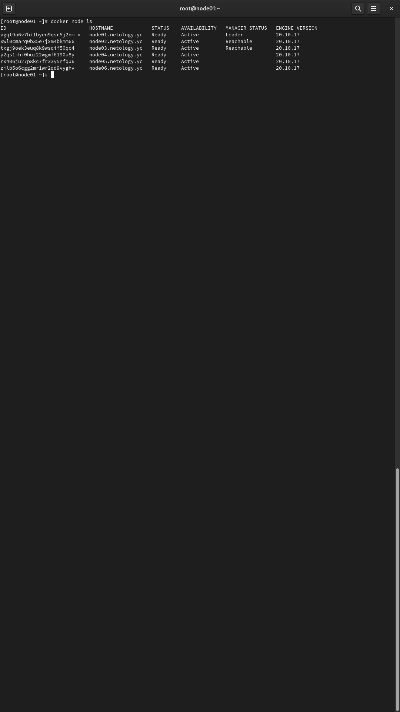
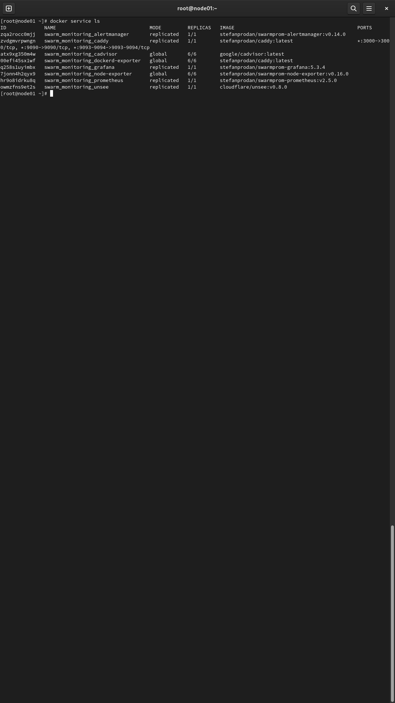
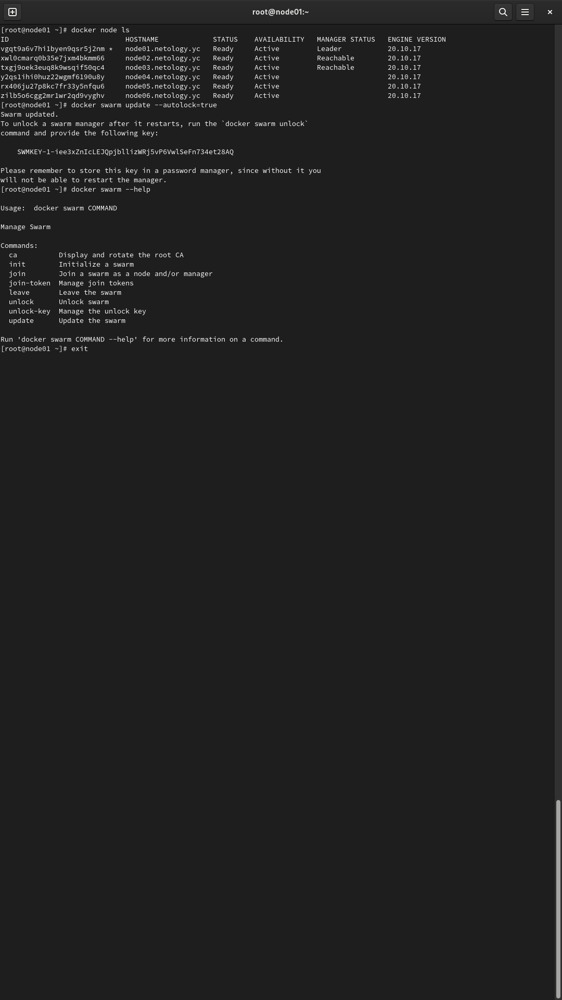

# Домашняя работа к занятию "5.5. Оркестрация кластером Docker контейнеров на примере Docker Swarm"

## Задача 1

Дайте письменые ответы на следующие вопросы:

- В чём отличие режимов работы сервисов в Docker Swarm кластере: replication и global?
###### `replication` - если сравнить с ООП, то чем-то похоже на класс с n экземплярами, где n - это количество реплик сервиса (горизонтальное масштабирование сервиса).
###### `global` - также можно частично сравнить с ООП, чем-то напоминает статический класс, у которого нет экземпляров, но функционал может применяться в других классах без создания экземпляра.
###### Если без аналогий, то основное отличие в применимости к сервисам. `replication` применяется к сервисам уровня реплики, которые могут потребовать баланисровки и масштабирования, а `global` это сервисы уровня кластера, которые не требуют масштабирования.

- Какой алгоритм выбора лидера используется в Docker Swarm кластере?

Используется алгоритм поддержания распределенного консенсуса - RAFT. У каждой ноды в роли manager выставлено время на ожидание запроса от лидера. 
Если по истечении этого времени запрос от лидера не пришел, то нода отправляет запрос на "голосование". 
Все ноды в статусе manager также ждут истечение времени и отправляют остальным нодам запрос. Если нода получает запрос до того как 
время закончится, то таймер сбрасывается. Та нода, которая раньше получит от всех ответ, становится лидером. Если у нескольких нод 
одновременно таймер истек и они отправили запрос, а у остальных таймер не обнулился в это время, то в голосовании останутся эти несколько
нод, а остальные отправляют им ответы. Допустим на второй круг голосования остались две ноды, когда они получили от всех ответ, эти две ноды отправляют повторный 
запрос. Нода, которая быстрее отправила запрос и сбросила у остальных таймеры останется лидером.

- Что такое Overlay Network?

Это внутренняя сеть для взимодействия и обмена данными внутри кластера между хостами, которые подключены к этой сети.

## Задача 2

Создать ваш первый Docker Swarm кластер в Яндекс.Облаке

Для получения зачета, вам необходимо предоставить скриншот из терминала (консоли), с выводом команды:
```
docker node ls
```

## Задача 3

Создать ваш первый, готовый к боевой эксплуатации кластер мониторинга, состоящий из стека микросервисов.

Для получения зачета, вам необходимо предоставить скриншот из терминала (консоли), с выводом команды:
```
docker service ls
```

## Задача 4 (*)

Выполнить на лидере Docker Swarm кластера команду (указанную ниже) и дать письменное описание её функционала, 
что она делает и зачем она нужна:

```
# см.документацию: https://docs.docker.com/engine/swarm/swarm_manager_locking/
docker swarm update --autolock=true
```


При инициации роя доступен ключ --autolock, благодаря которому включается функция автоблокировки для защиты кластера.
После создания кластера без этого ключа, можно данную функцию включить при помощи команды update с ключем --autolock=true.
После перезапуска Docker сработает автоблокировка узлов менеджера кластера. Эта функция введена для поддержки новой функции секретов Docker, а также для 
защиты конфигурации и данные от злоумышленников.
Для снятия блокировки необходимо ввести `docker swarm unlock`, после чего в ответ на запрос ввести ключ шифрования, который 
выдаст docker после включения автоблокировки.