# Домашняя работа к занятию "6.2. SQL"

## Задача 1

Используя docker поднимите инстанс PostgreSQL (версию 12) c 2 volume, 
в который будут складываться данные БД и бэкапы.

Приведите получившуюся команду или docker-compose манифест.
```dockerfile
version: '3.8'

services:
  
  postgres:
    image: postgres:12-alpine
    container_name: postgres_db
    volumes:
      - ./data_db:/var/lib/postgresql/data
      - ./backup_db:/var/lib/postgresql/backup
    environment:
      POSTGRES_PASSWORD: "admin"
      POSTGRES_USER: "admin"
      PGDATA: /var/lib/postgresql/data
    restart: unless-stopped
    ports:
      - "5432:5432"
    networks:
      - turreta_network

  pgadmin:
    image: dpage/pgadmin4
    container_name: pgadmin_db
    restart: unless-stopped
    environment:
      PGADMIN_DEFAULT_EMAIL: admin@admin.com
      PGADMIN_DEFAULT_PASSWORD: admin
    ports:
      - "8080:80"
    networks:
      - turreta_network

networks:
  turreta_network:
    driver: bridge
```

## Задача 2

В БД из задачи 1: 
- создайте пользователя test-admin-user и БД test_db

`CREATE DATABASE "test_db";`

`CREATE USER "test-admin-user" WITH PASSWORD 'admin';`

- в БД test_db создайте таблицу orders и clients (спeцификация таблиц ниже)

```dbn-sql
CREATE TABLE orders (
    order_id SERIAL PRIMARY KEY
   ,order_name VARCHAR(70)
   ,order_price INTEGER
);

/* 
Не совсем логично формировать внешний ключ в таблице клиент, так как мы ограничиваем клиента только одним заказом 
и говорим, что у заказа может быть несколько клиентов. Также нет возможности назначить правило ON DELETE CASCADE 
С таким правилом при удалении клиента должны удаляться все заказы, а у нас возникает обратная ситуация - при 
удалении заказа, удалятся все пользователи, связанные с заказом )))
*/   
CREATE TABLE clients (
    client_id SERIAL PRIMARY KEY
   ,client_lastname VARCHAR(30)
   ,client_country VARCHAR(50) NOT NULL
   ,client_order_id INTEGER REFERENCES orders
);
```

- предоставьте привилегии на все операции пользователю test-admin-user на таблицы БД test_db

```dbn-sql
GRANT ALL PRIVILEGES ON ALL TABLES 
IN SCHEMA "public" TO "test-admin-user";
```

- создайте пользователя test-simple-user

```dbn-sql
CREATE USER "test-simple-user" WITH PASSWORD 'user';
```

- предоставьте пользователю test-simple-user права на SELECT/INSERT/UPDATE/DELETE данных таблиц БД test_db

```dbn-sql
GRANT SELECT, INSERT, UPDATE, DELETE ON ALL TABLES 
IN SCHEMA "public" TO "test-simple-user";
```

Таблица orders:
- id (serial primary key)
- наименование (string)
- цена (integer)

Таблица clients:
- id (serial primary key)
- фамилия (string)
- страна проживания (string, index)
- заказ (foreign key orders)

Приведите:
- итоговый список БД после выполнения пунктов выше,

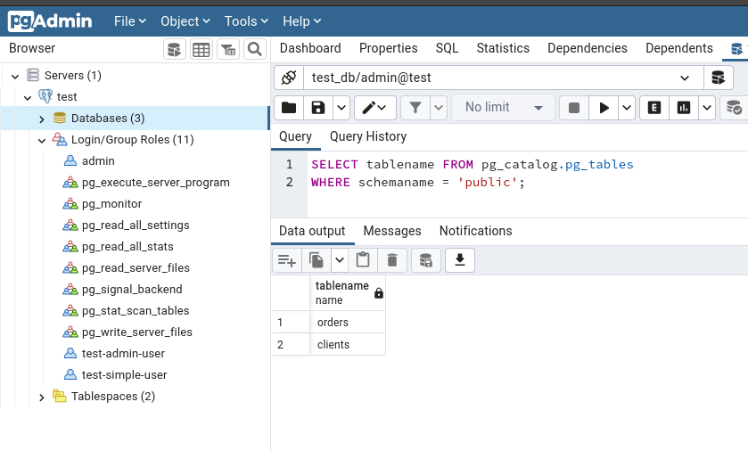

- описание таблиц (describe)

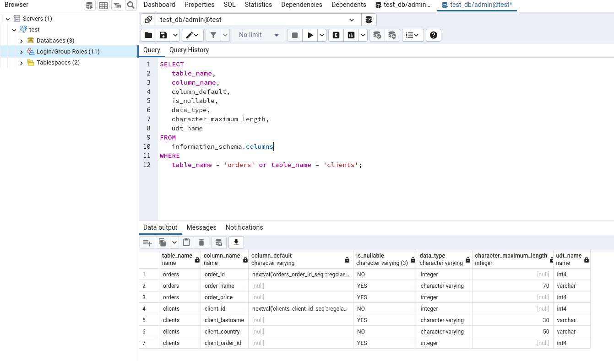

- SQL-запрос для выдачи списка пользователей с правами над таблицами test_db

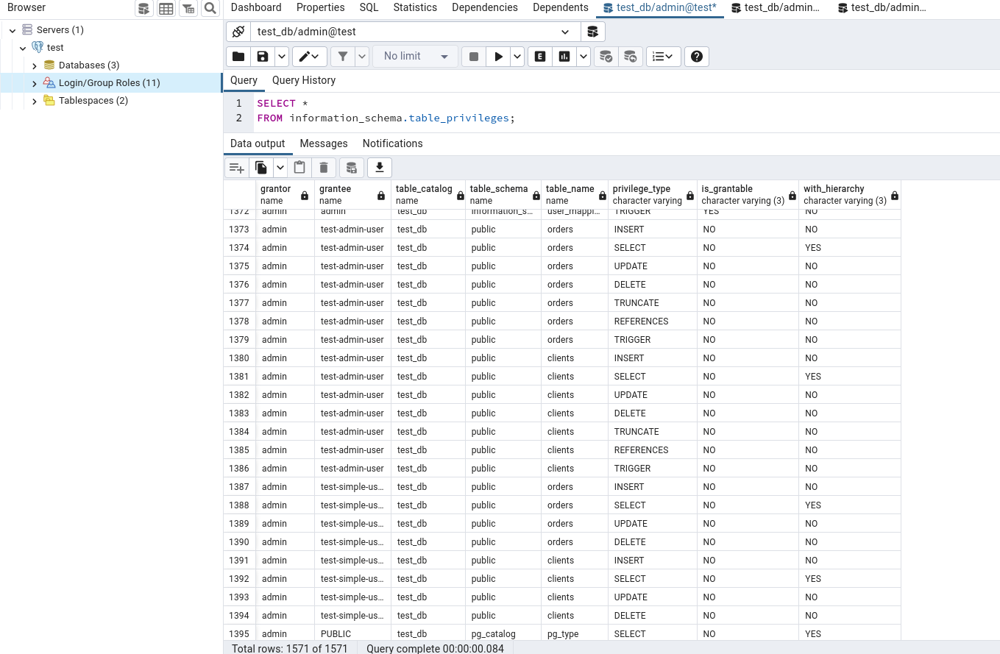

- список пользователей с правами над таблицами test_db

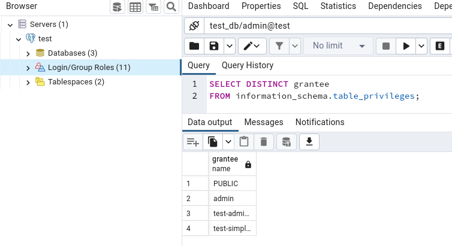

## Задача 3

Используя SQL синтаксис - наполните таблицы следующими тестовыми данными:

###### Моя невнимательность привела к некорректному наименованию поля "client_lastname" 
###### В ТЗ 'Фамилия', а в данных 'ФИО'. Не стал переделывать все ДЗ.

Таблица orders

|Наименование|цена|
|------------|----|
|Шоколад| 10 |
|Принтер| 3000 |
|Книга| 500 |
|Монитор| 7000|
|Гитара| 4000|

Таблица clients

|ФИО|Страна проживания|
|------------|----|
|Иванов Иван Иванович| USA |
|Петров Петр Петрович| Canada |
|Иоганн Себастьян Бах| Japan |
|Ронни Джеймс Дио| Russia|
|Ritchie Blackmore| Russia|

```dbn-sql
INSERT INTO orders (order_name, order_price) VALUES 
                   ('Шоколад', '10'),
                   ('Принтер', '3000'),
                   ('Книга', '500'),
                   ('Монитор', '7000'),
                   ('Гитара', '4000');
                   
INSERT INTO clients (client_lastname, client_country) VALUES 
                    ('Иванов Иван Иванович', 'USA'),
                    ('Петров Петр Петрович', 'Canada'),
                    ('Иоганн Себастьян Бах', 'Japan'),
                    ('Ронни Джеймс Дио', 'Russia'),
                    ('Ritchie Blackmore', 'Russia');
```

Используя SQL синтаксис:
- вычислите количество записей для каждой таблицы 
- приведите в ответе:
  - запросы 
  - результаты их выполнения.

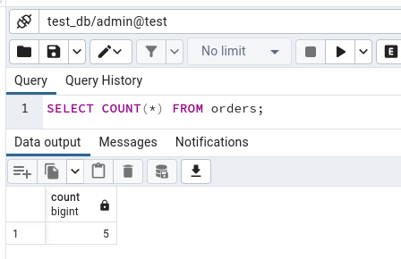

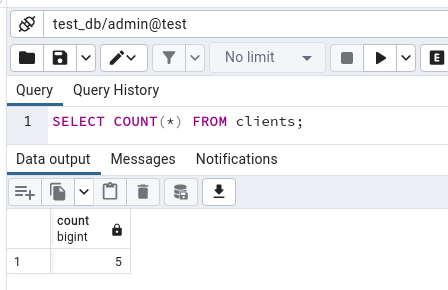

## Задача 4

Часть пользователей из таблицы clients решили оформить заказы из таблицы orders.

Используя foreign keys свяжите записи из таблиц, согласно таблице:

|ФИО|Заказ|
|------------|----|
|Иванов Иван Иванович| Книга |
|Петров Петр Петрович| Монитор |
|Иоганн Себастьян Бах| Гитара |

Приведите SQL-запросы для выполнения данных операций.

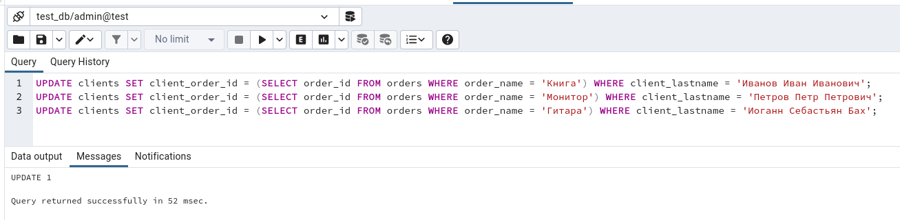

Приведите SQL-запрос для выдачи всех пользователей, которые совершили заказ, а также вывод данного запроса.

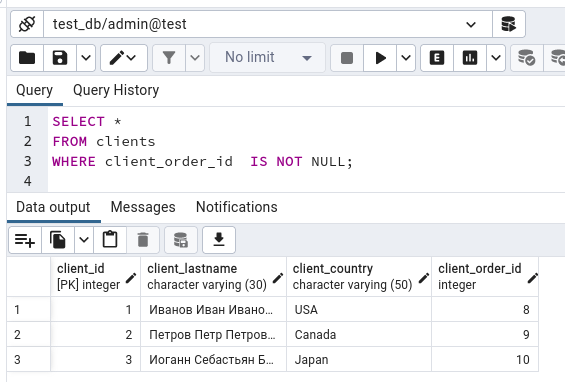
 
Подсказк - используйте директиву `UPDATE`.

## Задача 5

Получите полную информацию по выполнению запроса выдачи всех пользователей из задачи 4 
(используя директиву EXPLAIN).

Приведите получившийся результат и объясните что значат полученные значения.

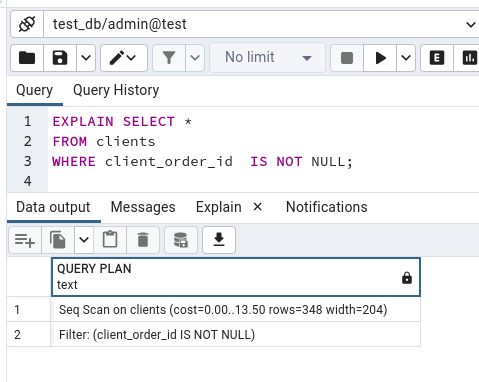

Seq Scan — последовательное, блок за блоком, чтение данных таблицы clients.
Сost - это не время, а некое понятие, призванное оценить затратность операции. 
Первое значение 0.00 — затраты на получение первой строки. 
Второе значение 1.05 — затраты на получение всех строк.
rows=3 — приблизительное количество возвращаемых строк при выполнении операции Seq Scan. 
Это значение возвращает планировщик.
width=47 — средний размер одной строки в байтах.

Для обновления статистики вызываем команду `ANALYZE clients;`

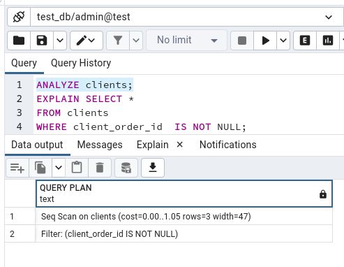


## Задача 6

Создайте бэкап БД test_db и поместите его в volume, предназначенный для бэкапов (см. Задачу 1).

Остановите контейнер с PostgreSQL (но не удаляйте volumes).

Поднимите новый пустой контейнер с PostgreSQL.

Восстановите БД test_db в новом контейнере.

Приведите список операций, который вы применяли для бэкапа данных и восстановления. 

`docker exec -it postgres_db /bin/bash` - подключение к контейнеру postgresql

`pg_dump -U admin -W test_db > /var/lib/postgresql/backup/backup.dump` - с помощью утилиты pg_dump создаю backup

Внес изменение в docker-compose для запуска в отдельном контейнере postgresql
```dockerfile
version: '3.8'

services:
  
  postgres:
    image: postgres:12-alpine
    container_name: postgres_db
    volumes:
      - ./data_db:/var/lib/postgresql/data
      - ./backup_db:/var/lib/postgresql/backup
    environment:
      POSTGRES_PASSWORD: "admin"
      POSTGRES_USER: "admin"
      PGDATA: /var/lib/postgresql/data
    restart: unless-stopped
    ports:
      - "5432:5432"
    networks:
      - turreta_network

  backup:
    image: postgres:12-alpine
    container_name: backup_db
    volumes:
      - ./backup_db:/var/lib/postgresql/backup
    environment:
      POSTGRES_PASSWORD: "admin"
      POSTGRES_USER: "admin"
      PGDATA: /var/lib/postgresql/data
    restart: unless-stopped
    ports:
      - "5422:5432"
    networks:
      - turreta_network

  pgadmin:
    image: dpage/pgadmin4
    container_name: pgadmin_db
    restart: unless-stopped
    environment:
      PGADMIN_DEFAULT_EMAIL: admin@admin.com
      PGADMIN_DEFAULT_PASSWORD: admin
    ports:
      - "8080:80"
    networks:
      - turreta_network

networks:
  turreta_network:
    driver: bridge
```

`docker-compose up -d --no-deps --build` - пересобрал docker-compose.yaml для запуска третьего контейнера

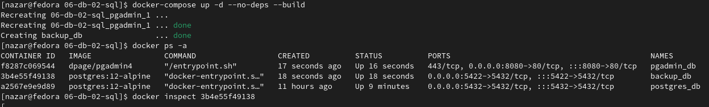

получаю ip контейнера postgresql backup - 172.19.0.4
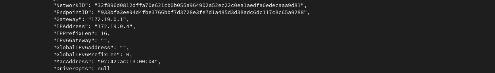

подключаю к pgAdmin второй контейнер для визуального контраля процесса подключения backup
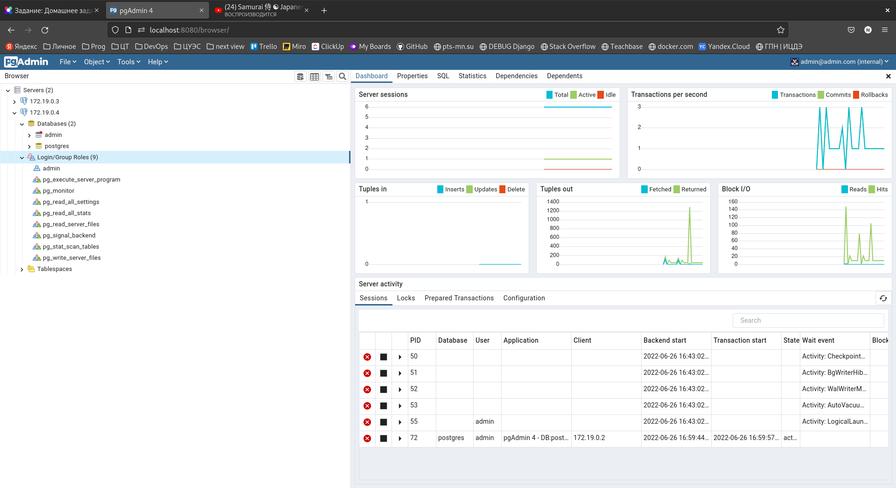

`CREATE DATABASE test_db;` - создаем пустую БД.

`psql -U admin -W test_db < /var/lib/postgresql/backup/backup.dump` - восстанавливаем db.

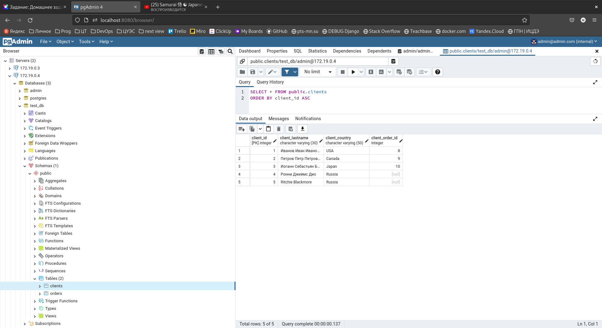

Данные восстановлены в новом контейнере.
