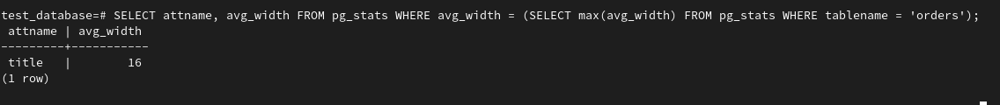

# Домашняя работа к занятию "6.4. PostgreSQL"

## Задача 1

Используя docker поднимите инстанс PostgreSQL (версию 13). Данные БД сохраните в volume.

Подключитесь к БД PostgreSQL используя `psql`.

Воспользуйтесь командой `\?` для вывода подсказки по имеющимся в `psql` управляющим командам.


**Найдите и приведите** управляющие команды для:
- вывода списка БД

`\l` - list databases

- подключения к БД

```dbn-psql
  \c[onnect] {[DBNAME|- USER|- HOST|- PORT|-] | conninfo}
```                     

- вывода списка таблиц

`\dt[S+] [PATTERN]` - list tables

- вывода описания содержимого таблиц

`\d[S+]  NAME ` - describe table, view, sequence, or index

- выхода из psql

`\q` - quit psql

## Задача 2

Используя `psql` создайте БД `test_database`.


Изучите [бэкап БД](https://github.com/netology-code/virt-homeworks/tree/master/06-db-04-postgresql/test_data).

Восстановите бэкап БД в `test_database`.

Перейдите в управляющую консоль `psql` внутри контейнера.

Подключитесь к восстановленной БД и проведите операцию ANALYZE для сбора статистики по таблице.

Используя таблицу [pg_stats](https://postgrespro.ru/docs/postgresql/12/view-pg-stats), 
найдите столбец таблицы `orders` с наибольшим средним значением размера элементов в байтах.




**Приведите в ответе** команду, которую вы использовали для вычисления и полученный результат.

***command***: `SELECT attname, avg_width FROM pg_stats WHERE avg_width = (SELECT max(avg_width) FROM pg_stats WHERE tablename = 'orders');`

***result***: `title`

## Задача 3

Архитектор и администратор БД выяснили, что ваша таблица orders разрослась до невиданных размеров и
поиск по ней занимает долгое время. Вам, как успешному выпускнику курсов DevOps в *Нетологии* предложили
**[провести разбиение таблицы на 2 (шардировать на orders_1 - price>499 и orders_2 - price<=499).**
]()
Предложите SQL-транзакцию для проведения данной операции.

```dbn-psql
BEGIN;
SET TRANSACTION ISOLATION LEVEL
CREATE TABLE orders_part (LIKE orders INCLUDING DEFAULTS) PARTITION BY RANGE (price);
CREATE TABLE orders_1 PARTITION OF orders_part FOR VALUES FROM (MINVALUE) TO (499);
CREATE TABLE orders_2 PARTITION OF orders_part FOR VALUES FROM (499) TO (MAXVALUE);
INSERT INTO orders_part SELECT * FROM orders;
COMMIT;
```

Можно ли было изначально исключить "ручное" разбиение при проектировании таблицы orders?

Да. Можно создать партиционированную таблицу изначально. Также можно в бизнес логике приложения заложить более сложные правила 
разбивки данных по таблицам.  

## Задача 4

Используя утилиту `pg_dump` создайте бекап БД `test_database`.


Как бы вы доработали бэкап-файл, чтобы добавить уникальность значения столбца `title` для таблиц `test_database`?


1) дописать значение UNIQUE в строках определения таблицы данных orders_part, orders_1, orders_2
2) если при создании новой таблицы применить INHERITS, то изменения вносить нужно только в одну таблицу, а к связанным таблицам изменения применятся автоматически.
3) дописать строки ALTER TABLE после создания таблиц `ALTER TABLE orders_part ADD CONSTRAINT title_uniq_part UNIQUE(title);` 
