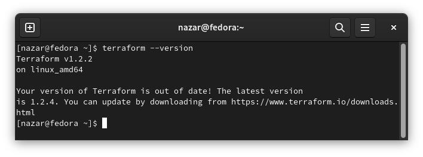

# Домашняя работа к занятию "7.1. Инфраструктура как код"

## Задача 1. Выбор инструментов. 
 
### Легенда
 
Через час совещание на котором менеджер расскажет о новом проекте. 
Начать работу над которым надо будет уже сегодня. 
На данный момент известно, что это будет сервис, который ваша компания будет предоставлять внешним заказчикам.
Первое время, скорее всего, будет один внешний клиент, со временем внешних клиентов станет больше.

Так же по разговорам в компании есть вероятность, что техническое задание еще не четкое, что приведет к большому
количеству небольших релизов, тестирований интеграций, откатов, доработок, то есть скучно не будет.  
   
Вам, как девопс инженеру, будет необходимо принять решение об инструментах для организации инфраструктуры.

На данный момент в вашей компании уже используются следующие инструменты: 
- остатки Сloud Formation, 
- некоторые образы сделаны при помощи Packer,
- год назад начали активно использовать Terraform, 
- разработчики привыкли использовать Docker, 
- уже есть большая база Kubernetes конфигураций, 
- для автоматизации процессов используется Teamcity, 
- также есть совсем немного Ansible скриптов, 
- и ряд bash скриптов для упрощения рутинных задач.  

Для этого в рамках совещания надо будет выяснить подробности о проекте, что бы в итоге определиться с инструментами:

1. Какой тип инфраструктуры будем использовать для этого проекта: изменяемый или не изменяемый?

**Частые релизы позволяют применять неизменяемую инфраструктуру, так как изменения можно будет вносить с каждым релизом, 
но по мере взросления проекта может потребоваться менять подход (со временем внешних клиентов станет больше и 
может потребоваться динамическая настройка серверов - например изменения в политике безопасности и т.п.).**

****В конце дополнительный комментарий***

2. Будет ли центральный сервер для управления инфраструктурой?

Возможно, для Teamcity может потребоваться центральный сервер, хотя я никогда не работал с ним, поэтому сложно судить.
`Модуль "Непрерывная интеграция еще не начинался так-то!!!`. Ansible, Terraform и Docker не требуют создания центрального сервера.
Создание центрального сервера это дополнительное слабое место в инфраструктуре, но в больших проектах при достаточном 
уровне безопасности и корректной настройке этот подход имеет преимущества. 

3. Будут ли агенты на серверах?

Опять таки, `Модуль "Непрерывная интеграция еще не начинался так-то!!!`, поэтому не знаю. Для остальных инструментов стека не требуются агенты.
Читал на Хабре, что teamcity использует агенты для процесса сборки.

4. Будут ли использованы средства для управления конфигурацией или инициализации ресурсов? 

**Да, исходя из комментария в конце задачи.**  

В связи с тем, что проект стартует уже сегодня, в рамках совещания надо будет определиться со всеми этими вопросами.

### В результате задачи необходимо

1. Ответить на четыре вопроса представленных в разделе "Легенда". 

**Ответил выше**

2. Какие инструменты из уже используемых вы хотели бы использовать для нового проекта?

**В конце указал свои рассуждения**

3. Хотите ли рассмотреть возможность внедрения новых инструментов для этого проекта?

**Указанных инструментов достаточно**

Если для ответа на эти вопросы недостаточно информации, то напишите какие моменты уточните на совещании.

Вопросы:
- Назначение сервиса? (от этого сильно зависит нагрузка и профиль нагрузки на сервер за сутки, а значит и инфраструктура)
- Какая аудитория у сервиса? (количество пользователей и рост их числа) 
- Режим работы клиентов. (от этого зависит как и когда мы будем выкатывать релизы)
- Для кого пишем сервис? (специфичные пользователи или широкий круг пользователей)
- Доступность сервиса? (какие ограничения по доступности сервиса? только в рабочее время или круглосуточно?)
- Бюджет проекта? (по нему можно будет относительно оценить масштаб сервиса и возможности развертывания инфраструктуры)

***Один внешний клиент понятие растяжимое. Это может быть сервис для hr (10-20 УЗ), а может быть сервис для всех сотрудников компании (50-5000 и более сотрудников).
Это неизвестная заставляется задуматься о том какая ожидается нагрузка на сервера, а значит непонятно какой подход применть.
Знание того, что ожидается увеличение количества клиентов я бы применил изменяемую инфораструктуру и полный набор имеющихся инструментов. 
Тем более, что неопределенные требования к сервису могут привести к росту масштаба сервиса и количества фич.*** 

## Задача 2. Установка терраформ. 

Официальный сайт: https://www.terraform.io/

Установите терраформ при помощи менеджера пакетов используемого в вашей операционной системе.
В виде результата этой задачи приложите вывод команды `terraform --version`.

## Задача 3. Поддержка легаси кода. 

В какой-то момент вы обновили терраформ до новой версии, например с 0.12 до 0.13. 
А код одного из проектов настолько устарел, что не может работать с версией 0.13. 
В связи с этим необходимо сделать так, чтобы вы могли одновременно использовать последнюю версию терраформа установленную при помощи
штатного менеджера пакетов и устаревшую версию 0.12. 

В виде результата этой задачи приложите вывод `--version` двух версий терраформа доступных на вашем компьютере 
или виртуальной машине.

